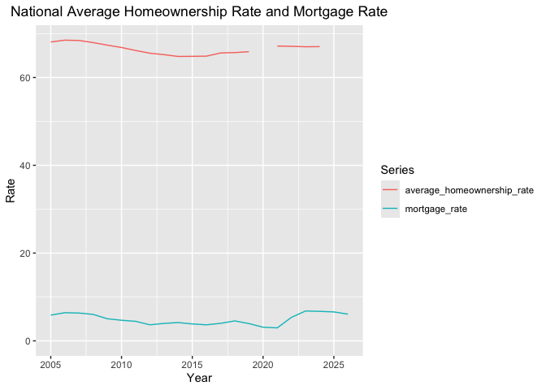
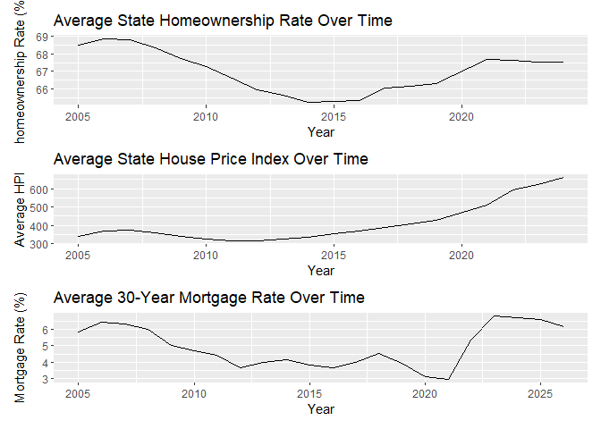
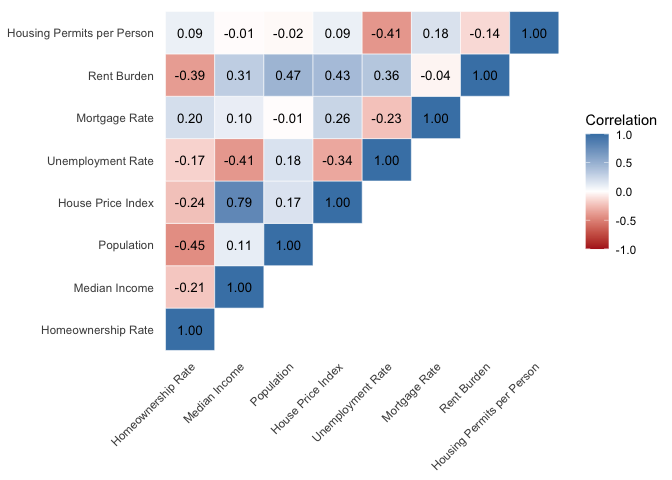
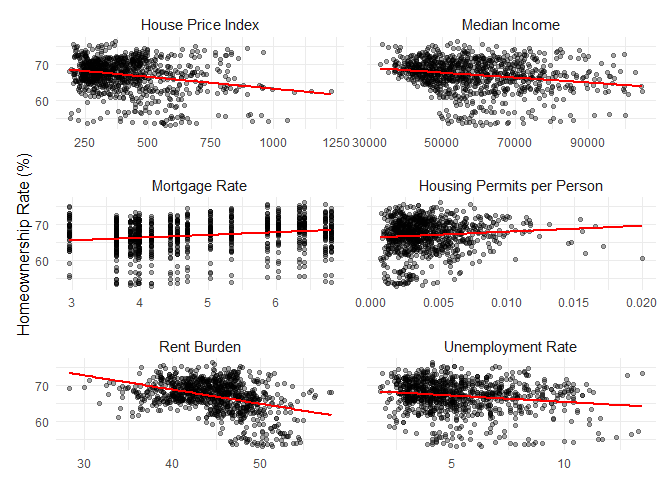
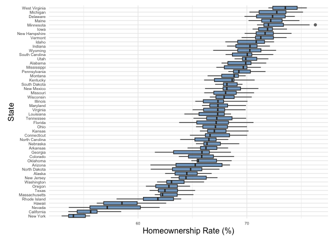
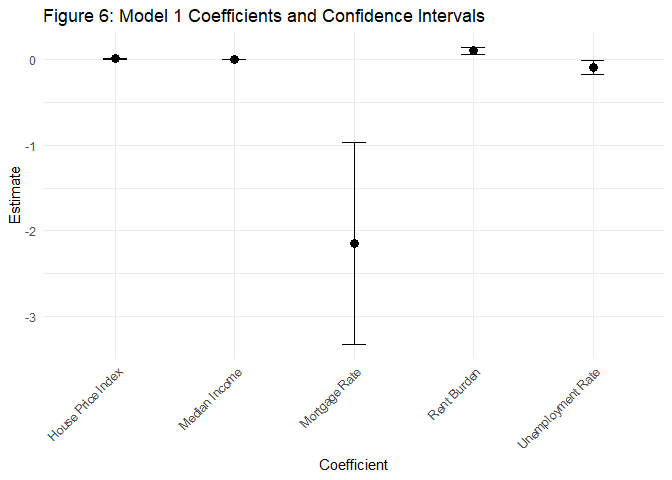
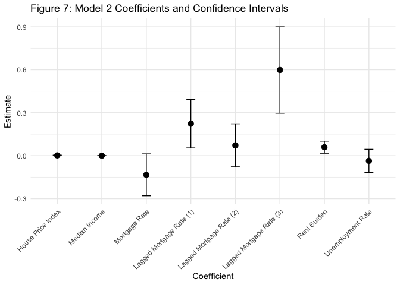
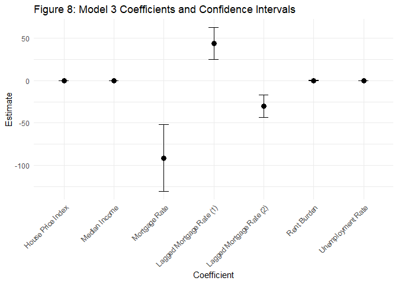
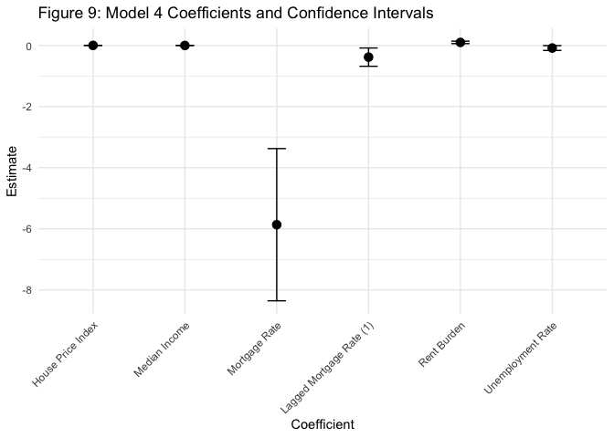

Class Project
================

- [Repository Guide](#repository-guide)
- [Introduction](#introduction)
- [Data Summary](#data-summary)
- [Data Analytics](#data-analytics)
  - [**Regression Analysis**](#regression-analysis)
- [Conclusion](#conclusion)
- [Policy Recommendation](#policy-recommendation)
- [Recorded Policy Brief](#recorded-policy-brief)
- [Version Control](#version-control)
  - [References](#references)

### **This landing page displays the knitted output of our README.Rmd file. For the code behind the analysis and figures shown below, please consult the README.Rmd file.**

# Repository Guide

This repository contains our group project for Software Tools for Data
Analysis. Our project studies how mortgage interest rates and housing
prices affect homeownership rates across U.S. states over time. The
final audience for this work is Scott Turner, U.S. Secretary of Housing
and Urban Development (HUD).

### Branch Structure

- `main`: current working branch for the final project deliverables
- `Checkpoint-1` branch: preserved as a historical archive of our first
  checkpoint submission
- `Checkpoint-2` branch: preserved as a historical archive of our second
  checkpoint submission

### Repository Contents

- `README.Rmd`: source file for this repository landing page
- `README.md`: knitted GitHub-facing version of the README
- `Data/`: raw and cleaned data files used in the analysis
- `Report Outline.docx`: working outline for the written report
- `README_files/`: figures generated from the README

# Introduction

Homeownership remains one of the most important pathways to
wealth-building, stability, and long-term financial security in the
United States. However, recent housing market conditions have made
homeownership increasingly difficult to attain for many families and
individuals. Higher mortgage rates raise the cost of borrowing, while
rising housing prices increase the upfront and long-term financial
burden of purchasing a home. These pressures are especially important
for the U.S. Department of Housing and Urban Development (HUD), which is
responsible for supporting fair, affordable, and sustainable access to
housing across the country.

This report is written for Scott Turner, U.S. Secretary of Housing and
Urban Development. As HUD considers how to address challenges with
affordability, expand access to homeownership, and support stable
housing markets, policymakers need evidence on which factors are most
closely associated with changes in homeownership rates. While mortgage
rates and housing prices are central to the current affordability
discussion, homeownership is also shaped by broader state-level
conditions. Some of these include income, unemployment, rent burden, and
housing supply. For that reason, our analysis examines both the direct
relationship between borrowing costs, housing prices, and homeownership,
as well as the role of additional economic and housing market drivers.

Our research question is: **How do mortgage interest rates, housing
prices, and related state-level economic and housing market conditions
affect homeownership rates across the United States over time?** To
answer this question, we construct a state-year panel dataset covering
U.S. states from 2005 to 2024. We exclude 2020 due to comparability
issues in one-year American Community Survey data during the COVID-19
period. We combine public data from the U.S. Census Bureau, Federal
Reserve Economic Data (FRED), the Federal Housing Finance Agency (FHFA),
the Bureau of Labor Statistics (BLS), and the Census Building Permits
Survey.

The results of this analysis can help HUD evaluate which policy levers
may be most relevant for improving access to homeownership. If
homeownership rates are strongly related to mortgage rates, housing
prices, rent burden, or housing supply, then federal housing policies
can be better targeted toward fixing conditions that most constrain
citizens from purchasing homes. These decisions have consequences beyond
individual buyers: homeownership patterns affect household wealth
accumulation, neighborhood stability, housing market equity, and the
broader economic health of communities.

# Data Summary

To study these relationships, we construct a state-year panel dataset
covering U.S. states from 2005 to 2024, excluding 2020 because one-year
American Community Survey data were not available in a comparable form
during the COVID-19 period. Each observation in the dataset represents
one state in one year. This structure allows us to compare both
differences across states and changes within states over time, making it
well suited for analyzing how economic and housing market conditions are
associated with homeownership outcomes.

The dataset combines several reputable public sources. Homeownership
rates, median income, population, and rent burden are drawn from the
U.S. Census Bureau’s American Community Survey. Mortgage rates come from
the Federal Reserve Economic Data database, while state-level housing
price data come from the Federal Housing Finance Agency House Price
Index. We also include unemployment data from the Bureau of Labor
Statistics and housing permit data from the Census Building Permits
Survey as a proxy for housing supply. After importing, cleaning, and
merging these sources, we use the resulting dataset to examine patterns
in homeownership, affordability, labor market conditions, and housing
supply across states. This combined dataset provides the foundation for
both our descriptive analysis and our regression modeling.

### **Summary Statistics:**

|  | Unique | Missing Pct. | Mean | SD | Min | Median | Max |
|----|----|----|----|----|----|----|----|
| Population | 950 | 0 | 6341021.1 | 7047104.4 | 495226.0 | 4439766.0 | 39557045.0 |
| Median Income | 935 | 0 | 58206.5 | 13858.1 | 32938.0 | 55645.5 | 104828.0 |
| Homeownership Rate | 950 | 0 | 67.0 | 4.4 | 53.0 | 67.5 | 76.3 |
| Mortgage Rate | 19 | 0 | 4.9 | 1.2 | 3.0 | 4.5 | 6.8 |
| Housing Price Index | 949 | 0 | 406.6 | 163.7 | 183.5 | 365.8 | 1229.7 |
| Unemployment Rate | 100 | 0 | 5.3 | 2.1 | 1.8 | 4.7 | 13.5 |
| Rent Burden | 950 | 0 | 44.6 | 4.4 | 28.3 | 44.9 | 58.1 |
| Housing Permits | 932 | 0 | 24953.9 | 35857.7 | 578.0 | 14327.5 | 287250.0 |
| Housing Permits Per Person | 950 | 0 | 0.0 | 0.0 | 0.0 | 0.0 | 0.0 |

The summary statistics above provide information about central
tendencies and variation across key variables over the period between
2005 and 2024 (excluding 2020). Note: these statistics were calculated
treating each state/year combination as a single observation. Statistics
reflect state conditions over this period and are not weighted by
population.

The average state had a population of 6.3 million, a median income of
approximately \$58,000, and an unemployment rate of 5.3 percent over the
analysis timeframe. The average state homeownership rate was 67 percent,
while the average national mortgage rate was 4.86 percent. An average of
just 0.004 housing permits were issued on annual basis per person, and
44 percent of the state population was rent burdened, on average.

The homeownership rate ranged from 52 percent to 76 percent, with a
standard deviation of 4.4 percent. The fact that the average
homeownership rate (67.0 percent) and median homeownership rate (67.5
percent) were similar, suggests that the distribution is roughly normal
(a histogram and accompanying analysis are provided below).

Several potential drivers of the homeownership rate showed substantial
variation across the analysis timeframe. The mortgage rate ranged from 3
to 6.8 percent with a standard deviation of 1.2 percent; the housing
price index ranged from 184to 1,230, with a standard deviation of 164;
and rent burden ranged from 28.3 to 58.1 percent with a standard
deviation of 4.4 percent. The variation of these variables in our sample
will allow us to meaningfully test their influence on the homeownership
rate.

### **Plot Histograms of Key Variables:**

<!-- -->

The histograms shown above provide useful information about the
distribution of homeownership rate and factors that may influence it.
The histograms were generally unimodal and bell shaped, though several
of them revealed significant kurtosis. Consistent with the observation
above that the mean and median homeownership rate are similar, the
histogram for the homeownership rate shows a mostly normal distribution,
albeit slightly skewed to the left. We see most states had homeownership
rates between 60 and 75 percent over the analysis timeframe. Only a
handful had homeownership rates below 60 percent. Rent burden data
appears normally distributed. With data distributed normally like this,
the mean can be a reliable representation for an average data point.
Since homeownership rate data is slightly left-skewed, its mean might be
slightly lower than where the graph actually peaks.

The housing price index and median income variables were both heavily
skewed to the right, with most median income values between \$40,000 and
\$70,000. This distribution of the data demonstrates that only a handful
of states were significantly wealthier or had higher housing prices than
their counterparts.

Housing permits per person also had a noticeable righthand tail, with
the majority of values being generally quite low. This suggests that a
few states were issuing permits faster (on a per person basis) a
significantly faster than other states and that it is infrequent to
generally see high levels of permits given that even the outliers were
relatively low in count.

The fact that population and the unemployment rate were also both
right-skewed is as expected. A handful of states (California, Texas,
Florida, and New York) are significantly more populous than the average
state, and the unemployment rate can more than double its typical level
during economic recessions.

# Data Analytics

### **Key Trends Over Time:**

<!-- --> Figure 2 shows broad
time trends in average state homeownership rates, house price index
values, and 30-year mortgage rates.

Exploring average state homeownership across time illustrates that it
peaked right before and declined following the 2008 recession. It hit
its minimum between 2014 and 2016 before gradually recovering in the
late 2010s and early 2020s, though not yet back to the levels seen in
2005. Over the same period, the average state HPI (House Price Index)
increased substantially, suggesting that housing prices rose much faster
than homeownership rates recovered. The HPI, a means of measuring the
rate at which home prices are changing across the housing market in the
U.S., is an important indicator of the housing market as it reflects the
kind of market (whether buyers or sellers are more so advantaged), and
the year-to-year change indicating strength and growth. The mortgage
rate trend provides additional context. The 30-year mortgage rate
started to decline around and following the 2008 recession, staying
consistently low from about 2012 through 2016. While it once again
plummeted from roughly 2018 through 2021, it saw a sharp rise
immediately after and only recently started to plateau – at its highest
level in the past 20 years. This creates an important policy concern, as
even though homeownership partially recovered after the mid-2010s,
households now face a combination of elevated housing prices and higher
borrowing costs. Together, these trends suggest that homeownership
affordability is shaped by multiple pressures at once rather than by any
single variable alone.

### **Correlation Matrix:**

<!-- -->

Figure 3, the correlation heatmap provides an initial look at the
relationships among different variables before moving into regression
analysis. Homeownership has negative correlations with population, rent
burden, house price index, median income, and unemployment, indicates
that states with larger populations, higher housing costs, and greater
rental affordability pressure tend to have lower homeownership rates.
Homeownership rate’s moderately negative correlation with population and
rent burden may also suggest that since areas with higher populations
had lower rates of homeownership there were likely higher levels of
renting. The negative relationship with rent burden is especially
important because it suggests that places where renters face greater
financial strain may also be places where households have more
difficulty transitioning into ownership.

The heatmap also shows several relationships among the explanatory
variables themselves. Median income and house price index have a strong
positive correlation, indicating that higher-income states also tend to
have more expensive housing markets. Rent burden (spending more than 30%
of gross household income on rent; high rental cost relative to income)
is moderately, positively correlated with population and house price
index. In other words, where the population is larger, there is a larger
rent burden; this supports the broader affordability story that larger
and more expensive states tend to place more pressure on renters. These
correlations help motivate the use of multivariable regression, since
homeownership is related to several overlapping economic and housing
market conditions rather than one factor in isolation.

<!-- -->

Figure 4 compares homeownership rates with several key predictors using
scatterplots and fitted trend lines. The clearest negative relationship
appears between rent burden and homeownership: as rent burden increases,
homeownership rates tend to decline. This supports the idea that states
where renters face greater financial pressure may also be states where
households have more difficulty transitioning into homeownership.

House price index, median income, and unemployment rate also show
negative relationships with homeownership, though the strength and
interpretation of these patterns vary. The negative relationship between
house prices and homeownership is consistent with an affordability
issue, since higher housing costs may make ownership less accessible.
The median income relationship is more complicated because higher-income
states may also be states with substantially higher housing costs,
meaning income alone does not necessarily translate into easier access
to homeownership. Mortgage rates and housing permits per person show
slightly positive trend lines in this figure, but these relationships
should be interpreted cautiously because they do not account for
differences across states, changes over time, or other overlapping
economic conditions.

<!-- -->

Figure 5 shows the distribution of homeownership rates by state across
the study period. States are ordered by their typical homeownership
rate, making it easy to identify states that consistently have higher or
lower ownership levels. West Virginia, Michigan, Delaware, Maine, and
Minnesota appear near the top of the distribution (~ 70-75%
homeownership rate), while New York, California, Nevada, Hawaii, and
Rhode Island (~ 55-60% homeownership rate) appear near the bottom.

The lower-homeownership states are especially important for HUD because
many of them are large or high-cost housing markets where affordability
challenges are likely more severe. For example, California and New York
have relatively low homeownership rates, which is consistent with the
broader finding that higher housing costs and rent burden are associated
with lower ownership. The chart also shows that some states have wider
ranges than others, meaning homeownership conditions changed more over
time in certain states while remaining more stable in others.

### **Multicollinearity Check:**

    ##     mortgage_rate               hpi unemployment_rate     median_income 
    ##          1.169637          3.585337          2.272322          3.257880 
    ##       rent_burden   perm_per_person 
    ##          1.927072          1.314518

The multicollinearity check suggests that the predictors can be included
together in the regression model without serious multicollinearity
concerns. All variance inflation factor values are below the common
threshold of 5, and well below the stricter threshold of 10, meaning
that none of the predictors appears to be excessively redundant with the
others. The highest values are for house price index and median income,
which makes sense because states with higher incomes often also have
higher housing prices. However, these values are still moderate, so the
model can reasonably estimate the relationship between each predictor
and homeownership while controlling for the others.

## **Regression Analysis**

After exploring patterns in the data and potential relationships between
key variables, we then engaged in more rigorous econometric modeling to
test which variables meaningfully influence the homeownership rate after
controlling for observable factors as well as state and year fixed
effects. The results of that analysis are shown below.

For directions on how to conduct multilinear regression and plot
confidence intervals, [click
here](https://www.geeksforgeeks.org/r-language/how-to-use-the-coeftest-function-in-r/).

### **Model 1**

    ## 
    ## Table 2: OLS Regression with Controls
    ## =================================================================
    ##                                      Homeownership Rate          
    ## -----------------------------------------------------------------
    ## Mortgage Rate                             -2.14***               
    ##                                            (0.60)                
    ##                                                                  
    ## House Price Index                         0.003***               
    ##                                           (0.001)                
    ##                                                                  
    ## Median Income                             -0.0000                
    ##                                           (0.0000)               
    ##                                                                  
    ## Unemployment Rate                         -0.10**                
    ##                                            (0.04)                
    ##                                                                  
    ## Rent Burden                               0.10***                
    ##                                            (0.02)                
    ##                                                                  
    ## Housing Permits per Person                77.27***               
    ##                                           (24.51)                
    ##                                                                  
    ## N                                           950                  
    ## R2                                          0.97                 
    ## Adjusted R2                                 0.96                 
    ## Residual Std. Error                   0.83 (df = 877)            
    ## F Statistic                       362.36*** (df = 72; 877)       
    ## =================================================================
    ## Notes:                     ***Significant at the 1 percent level.
    ##                             **Significant at the 5 percent level.
    ##                             *Significant at the 10 percent level.

<!-- -->

In the first model we estimated included all our variables of interest
(mortgage rate, housing price index, rent burden, and housing permits
per person) as well as control variables (median income and the
unemployment rate) and state and year fixed effects. The R2 value of
0.97 tells us that 97 percent of the variability in the homeownership
rate is explained by the parameters included in the model. The mortgage
rate, housing price index, rent burden, and housing permits per person
are all significant at the one percent level, while the unemployment
rate is significant at the five percent level.

Several of the variables had effects consistent with what one would
expect. For example, the coefficient on the mortgage rate implies that
one percentage point increase is associated with a 2.14 percentage point
reduction in the homeownership rate. A 0.1 increase in annual housing
permits per person is associated with a 7.7 percentage point increase in
homeownership rate, whereas a one percentage point decrease in the
unemployment rate was associated with a 0.1 percentage reduction.

Other variables had coefficients that appeared potentially counter
intuitive. For example, the coefficient on the housing price index was
positive, implying that states with less affordable housing had higher
homeownership rates, all else being equal. This is theoretically
inconsistent and is suggestive of omitted variable bias (i.e., an
unobserved variable may be correlated with the housing price index). It
was also surprising to observe that rent burden had a positive
coefficient, which implies that states with a greater share of the
population burdened by rent had higher homeownership rates, all else
being equal. One possible explanation is that individuals living in
states with unusually high rent may have an incentive to buy their first
home earlier in life rather than wait and save for their ideal home.

A key weakness of this model is that it does not account for the fact
that the mortgage rate likely has a lagged effect on the homeownership
rate. That is, individuals may observe a change in the mortgage rate,
then start the process of saving for and financing a home, which can
take months or years. Thus, it is possible that changes in the mortgage
rate influences human behavior and the homeownership rate in the later
years. To explore this relationship, we estimated three more regression
models: one with three lagged mortgage rate variables, one with two
lagged variables, and one with one lagged variable. The results of those
models are shown below.

### **Model 2**

    ## 
    ## Table 3: OLS Regression with 3 Lags
    ## =================================================================
    ##                                      Homeownership Rate          
    ## -----------------------------------------------------------------
    ## Mortgage Rate                              -0.13*                
    ##                                            (0.07)                
    ##                                                                  
    ## Lagged Mortgage Rate (1)                  0.22***                
    ##                                            (0.09)                
    ##                                                                  
    ## Lagged Mortgage Rate (2)                    0.07                 
    ##                                            (0.08)                
    ##                                                                  
    ## Lagged Mortgage Rate (3)                  0.60***                
    ##                                            (0.15)                
    ##                                                                  
    ## House Price Index                          0.002*                
    ##                                           (0.001)                
    ##                                                                  
    ## Median Income                              0.0000                
    ##                                           (0.0000)               
    ##                                                                  
    ## Unemployment Rate                          -0.04                 
    ##                                            (0.04)                
    ##                                                                  
    ## Rent Burden                               0.06***                
    ##                                            (0.02)                
    ##                                                                  
    ## Housing Permits per Person               114.42***               
    ##                                           (30.52)                
    ##                                                                  
    ## N                                           800                  
    ## R2                                          0.97                 
    ## Adjusted R2                                 0.97                 
    ## Residual Std. Error                   0.80 (df = 730)            
    ## F Statistic                       339.23*** (df = 69; 730)       
    ## =================================================================
    ## Notes:                     ***Significant at the 1 percent level.
    ##                             **Significant at the 5 percent level.
    ##                             *Significant at the 10 percent level.

<!-- -->

Including three lagged variables resulted in theoretically inconsistent
results. The three lagged mortgage rate variables all had small positive
effects on the homeownership rate, which is inconsistent and likely due
to model noise.

### **Model 3**

    ## 
    ## Table 4: OLS Regression with 2 Lags
    ## =================================================================
    ##                                      Homeownership Rate          
    ## -----------------------------------------------------------------
    ## Mortgage Rate                              -0.13*                
    ##                                            (0.07)                
    ##                                                                  
    ## Lagged Mortgage Rate (1)                  0.22***                
    ##                                            (0.09)                
    ##                                                                  
    ## Lagged Mortgage Rate (2)                    0.07                 
    ##                                            (0.08)                
    ##                                                                  
    ## House Price Index                         0.60***                
    ##                                            (0.15)                
    ##                                                                  
    ## Median Income                              0.002*                
    ##                                           (0.001)                
    ##                                                                  
    ## Unemployment Rate                          0.0000                
    ##                                           (0.0000)               
    ##                                                                  
    ## Rent Burden                                -0.04                 
    ##                                            (0.04)                
    ##                                                                  
    ## Housing Permits per Person                0.06***                
    ##                                            (0.02)                
    ##                                                                  
    ## perm_per_person                          114.42***               
    ##                                           (30.52)                
    ##                                                                  
    ## N                                           800                  
    ## R2                                          0.97                 
    ## Adjusted R2                                 0.97                 
    ## Residual Std. Error                   0.80 (df = 730)            
    ## F Statistic                       339.23*** (df = 69; 730)       
    ## =================================================================
    ## Notes:                     ***Significant at the 1 percent level.
    ##                             **Significant at the 5 percent level.
    ##                             *Significant at the 10 percent level.

<!-- -->

The third model included two lagged mortgage rate variables. The results
of this model were even more nonsensical. The mortgage rate variable and
the two-year lagged variable both had large, negative coefficients,
while the coefficient on the one year lagged variable was similarly
large and positive. All three coefficient were significant at the one
percent level.

### **Model 4**

    ## 
    ## Table 5: OLS Regression with 1 Lag
    ## =================================================================
    ##                                      Homeownership Rate          
    ## -----------------------------------------------------------------
    ## Mortgage Rate                              -0.13*                
    ##                                            (0.07)                
    ##                                                                  
    ## Lagged Mortgage Rate (1)                  0.22***                
    ##                                            (0.09)                
    ##                                                                  
    ## House Price Index                           0.07                 
    ##                                            (0.08)                
    ##                                                                  
    ## Median Income                             0.60***                
    ##                                            (0.15)                
    ##                                                                  
    ## Unemployment Rate                          0.002*                
    ##                                           (0.001)                
    ##                                                                  
    ## Rent Burden                                0.0000                
    ##                                           (0.0000)               
    ##                                                                  
    ## Housing Permits per Person                 -0.04                 
    ##                                            (0.04)                
    ##                                                                  
    ## rent_burden                               0.06***                
    ##                                            (0.02)                
    ##                                                                  
    ## perm_per_person                          114.42***               
    ##                                           (30.52)                
    ##                                                                  
    ## N                                           800                  
    ## R2                                          0.97                 
    ## Adjusted R2                                 0.97                 
    ## Residual Std. Error                   0.80 (df = 730)            
    ## F Statistic                       339.23*** (df = 69; 730)       
    ## =================================================================
    ## Notes:                     ***Significant at the 1 percent level.
    ##                             **Significant at the 5 percent level.
    ##                             *Significant at the 10 percent level.

<!-- -->

The fourth and final model included just one lagged variable. The
coefficient on the one year lagged mortgage rate variable is modest, but
negative as expected and statistically significant at the five percent
level. The coefficients on the other variables are generally similar to
the ones from the first model, with two notable exceptions. First the
effect of the current mortgage rate is shown to be nearly three times as
big. In model 4, a one percentage point increase in the current mortgage
rate is associated with a 5.9 percentage point reduction in the
homeownership rate, all else being equal (compared to the 2.1 percentage
reduction shown in model 1). The second notable change was to the
housing permits per person variable. In Model 4, a 0.1 increase in
annual housing permits per person is associated with a 9.1 percentage
point increase in homeownership rate (compared to the 7.7 percentage
point reduction shown in Model 1).

Model 4 is our preferred model. We believe there is strong theoretical
justification that the mortgage rate would have a delayed effect on the
homeownership rate (i.e., saving and financing a house does not happen
overnight). Including multiple lags disrupted the model in ways that
undermined reason (coefficients were unintuitive, the effect of the
unemployment rate was no longer statistically significant, etc.).
However, including just one lagged mortgage rate variable seemed to
improve the model. The coefficient on the lagged variable was negative
as expected (and statistically significant), and the other variables
were not influenced in implausible ways. As noted, the coefficients on
the current mortgage rate and housing permits per person both increased
in magnitude, but not to an unreasonable degree.

### **Compare Models**

    ## 
    ## Table 6: Regression Comparisons)
    ## ==============================================================================================================================
    ##                                                                    Homeownership Rate                                         
    ##                                      OLS                  OLS - 3 Lags             OLS - 2 Lags             OLS - 1 Lag       
    ##                                      (1)                      (2)                      (3)                      (4)           
    ## ------------------------------------------------------------------------------------------------------------------------------
    ## Mortgage Rate                      -2.14***                  -0.13*                 -91.49***                 -5.86***        
    ##                                     (0.60)                   (0.07)                  (20.12)                   (1.27)         
    ##                                                                                                                               
    ## Lagged Mortgage Rate (1)                                    0.22***                  43.69***                 -0.38**         
    ##                                                              (0.09)                   (9.60)                   (0.15)         
    ##                                                                                                                               
    ## Lagged Mortgage Rate (2)                                      0.07                  -30.09***                                 
    ##                                                              (0.08)                   (6.64)                                  
    ##                                                                                                                               
    ## Lagged Mortgage Rate (3)                                    0.60***                                                           
    ##                                                              (0.15)                                                           
    ##                                                                                                                               
    ## House Price Index                  0.003***                  0.002*                  0.002**                  0.002**         
    ##                                    (0.001)                  (0.001)                  (0.001)                  (0.001)         
    ##                                                                                                                               
    ## Median Income                      -0.0000                   0.0000                   0.0000                   0.0000         
    ##                                    (0.0000)                 (0.0000)                 (0.0000)                 (0.0000)        
    ##                                                                                                                               
    ## Unemployment Rate                  -0.10**                   -0.04                    -0.06                   -0.08**         
    ##                                     (0.04)                   (0.04)                   (0.04)                   (0.04)         
    ##                                                                                                                               
    ## Rent Burden                        0.10***                  0.06***                  0.08***                  0.10***         
    ##                                     (0.02)                   (0.02)                   (0.02)                   (0.02)         
    ##                                                                                                                               
    ## Housing Permits per Person         77.27***                114.42***                 91.45***                 91.04***        
    ##                                    (24.51)                  (30.52)                  (29.83)                  (27.69)         
    ##                                                                                                                               
    ## N                                    950                      800                      850                      900           
    ## R2                                   0.97                     0.97                     0.97                     0.97          
    ## Adjusted R2                          0.96                     0.97                     0.97                     0.97          
    ## Residual Std. Error            0.83 (df = 877)          0.80 (df = 730)          0.82 (df = 779)          0.83 (df = 828)     
    ## F Statistic                362.36*** (df = 72; 877) 339.23*** (df = 69; 730) 341.97*** (df = 70; 779) 353.64*** (df = 71; 828)
    ## ==============================================================================================================================
    ## Notes:                                                                                  ***Significant at the 1 percent level.
    ##                                                                                          **Significant at the 5 percent level.
    ##                                                                                          *Significant at the 10 percent level.

The above table depicts all of the models side-by-side for comparison
Our preferred model, Model 4, is show in the column furthest right.

# Conclusion

This project examined how mortgage interest rates, housing prices, and
related economic and housing market variables are associated with
homeownership rates across U.S. states over time. To answer this
question, we constructed a state-year panel dataset combining
homeownership rates, median income, population, rent burden, mortgage
rates, house price index values, unemployment rates, and housing permits
per person. We used descriptive visualizations, correlation analysis,
state-level distribution plots, multicollinearity checks, and regression
models to study both broad trends and more specific relationships among
these variables.

The analysis shows that homeownership rates vary meaningfully across
both time and states. Average homeownership declined from the mid-2000s
into the mid-2010s before partially recovering in the late 2010s and
early 2020s. However, this recovery occurred alongside a sharp rise in
house price index values and, after 2021, a rapid increase in mortgage
rates. This suggests that the current housing environment is shaped by
multiple affordability pressures at once: households face not only
higher home prices, but also higher borrowing costs.

Several patterns from the visual analysis help clarify the broader
story. The correlation heatmap and scatterplots suggest that
homeownership tends to be lower in states with higher population, higher
rent burden, higher house price index values, and higher unemployment.
Rent burden appears especially important because it connects the rental
and ownership sides of the housing market: states where renters are
already financially strained may also be states where households have
more difficulty moving into ownership. The box plot by state also shows
substantial geographic variation, with states such as New York,
California, Nevada, Hawaii, and Rhode Island consistently showing lower
homeownership rates than many other states.

The regression analysis adds further support to the idea that
homeownership is influenced by several overlapping economic and housing
market conditions. Mortgage rates are generally negatively associated
with homeownership, especially in the baseline and controlled models,
which is consistent with the idea that higher borrowing costs reduce
access to ownership. Housing supply, measured through housing permits
per person, appears positively associated with homeownership in the
models, suggesting that states with more residential construction
activity may have stronger ownership outcomes. Rent burden and
unemployment also provide important context, although some relationships
are more complex once controls and lagged variables are included.

There are several limitations to this analysis. First, the project uses
observational data, so the results should be interpreted as associations
rather than definitive causal effects. Second, some variables are
measured at the national level, such as the 30-year mortgage rate, while
others vary by state and year, which limits how precisely we can isolate
state-specific mortgage effects. Third, the exclusion of 2020 due to ACS
comparability issues helps maintain consistency but removes an important
year from the housing market timeline. Finally, our housing supply
measure captures permits rather than completed housing units, so it may
not fully reflect the actual availability of homes.

Future work could improve the analysis by incorporating more localized
data at the county or metropolitan level, adding measures of housing
inventory and new construction completions, and exploring differences by
household income, race, age, or first-time buyer status. Additional
modeling could also test fixed effects more deeply, examine regional
differences, or use causal inference methods to better isolate the
effects of policy-relevant housing market changes.

# Policy Recommendation

Key trends over the past two decades present an important policy
concern: even though homeownership partially recovered after the
mid-2010s, households now face a combination of elevated housing prices
and higher borrowing costs. Given the robust finding that more permits
per capita are associated with higher rates of homeownership and high
rent burden negative correlation with the homeownership rate, we would
advice HUD Secretary Scott Turner to approach subsequent policy with a
two-pronged approach: federal legislation efforts should first be
directed toward reducing zoning regulations to increase the housing
supply and, subsequently, be put toward the HOME Program to allow for
both financing of the building of affordable home and rental properties
as well as increased access to subsidized and/or lower fixed-rate
mortgages.

To accomplish this, policy should focus on the reduction of various
barriers. For example, working to update zoning regulations to
streamline the use of land and permit more density and innovative
construction techniques/housing types. It is important not simply to
increase housing generally but to increase affordable housing, as
homeownership rates are lower in largely populated areas where the rent
burden is already high. In addition to increasing the homeownership
rate, increasing access to affordable housing also has a wealth of other
benefits for people. There have been several initiatives at the state
level that can be applied at the federal level to improve homeownership
generally, as well as to help states that are at a lower rate
potentially catch up. Actions like lessening parking requirements,
density limits, and minimum lot sizes for new residential buildings
allow for more financially feasible constructions. Thus, finding ways to
reduce these kinds of restrictive zoning, which are otherwise
contributing to the affordability crisis in the US, may further aid this
endeavor to increase homeownership rates.

By reducing zoning barriers, an important, short-term effect is being
able to issue more housing permits, which can, in turn, be used to build
at a lower cost per-unit. While generally increasing the supply of
affordable housing supply may also contribute to a reduction in
experienced rent burden, other reductions, such as in parking
requirements, could contribute to lower rent and, in turn, rent burden.
Doing so allows a city to meet the actual needs of a given community
while lowering the costs of new construction–a burden that would
otherwise be put on future tenants. In the long term, people may become
more able to save for and purchase houses. Further, with more
high-density housing and less parking–particularly if this is focused in
transit hubs–people may be more inclined and able to opt to use public
transportation and/or live closer to their jobs, which could help reduce
carbon emissions in the long term. While changes to zoning to allow for
densification may increase property value, however, care must be taken
to ensure that low-income neighborhoods affected by these changes don’t
experience high levels of gentrification and displacement–a potential,
negative, and long-term effect of this process; given the homeownership
rate’s relationship with rent burden, providing affordable housing must
stay at the core of these policy changes. As housing supply eventually
increases, high-density areas may also experience greater strain on
institutions and community organizations, such as schools, hospitals,
playgrounds, and places of worship.

Furthermore, with high rent burden correlated with low homeownership,
actions should be taken to also address this renter issue to allow for
mobility toward homeownership for those who want to purchase a house but
have historically financially struggled to do so because of the already
large burden of rent. This could be approached by the development of
more affordable dedicated-rental properties and/or expanded rental
assistance. Given this, we also need to turn to the impact mortgage
rates have, with a one percentage point increase resulting in both an
immediate and long-term negative effect on homeownership. With mortgage
rates rising and staying high in recent years, it would also be
beneficial to expand access to and opportunity for subsidized and/or
lower fixed-rate mortgages. Combined, further resources and energy need
to be directed toward the HOME Investment Partnerships Program, both at
the rental (renter and rental construction development) and
homeownership levels. It is recommended that specific focus be given to
states with the lowest rates of homeownership, like California, New
York, Nevada, and Hawaii. Those at the federal level should aim to work
with and hear from homeowners, developers, and local and state
legislators to best understand the needs of those in areas struggling
most, as well as to assist with increasing the supply of housing by
supporting the implementation of pre-reviewed housing designs and
planning efforts. Inspiration can also be taken from successful state
policies, especially in states with higher rates of homeownership, more
permits per capita, and lower rent burden.

Increased access to subsidized and/or lower fixed-rate mortgages may
make homeownership more attainable for people who previously found it
out of reach. By focusing the HOME Program support first to states with
the lowest homeownership rates, more resources can be put toward the
development of necessary intermediate steps like lowering rent burden
and increasing housing supply. It may also be mutually beneficial to
engage in conversation with those who have a stake in the outcome of
this legislation. Community members and legislators can help shape
certain decisions by providing their specific insights, and proactive
involvement may help reduce the level of uncertainty or resistance
residents might otherwise feel if outsiders were making decisions for
and about their community. In the long-term, it is essential that the
housing supply is able to increase as these kinds of mortgages become
available to avoid the inflation risk it would otherwise run. An
anti-displacement strategy is also required in the long run to protect
current renters and homeowners in low-income communities, who may
otherwise be harmed by the effects of new construction and a high
density of new units.

Ultimately, legislation that is two-fold–i.e., that addresses the issues
of housing supply and affordability by reducing zoning regulations and
directing HOME Program resources toward states with lower homeownership
for permits and construction as well as toward increased access to
subsidized and/or lower fixed-rate mortgages–will allow the Department
of Housing and Urban Development to comprehensively address these
barriers to homeownership.

# Recorded Policy Brief

TO BE ADDED BY MAY 11.

# Version Control

\[Version control text here.\] \### Team Workflow To keep the repository
organized, team members should: 1. Pull the most recent version of the
repository before starting work 2. Make changes locally in the
appropriate files 3. Knit `README.Rmd` after updating it so that
`README.md` stays current 4. Commit changes with clear commit messages
5. Push updates after meaningful progress

## References

### Data

Federal Housing Finance Agency. (n.d.). *FHFA House Price Index®
datasets*. Retrieved 2026, from
<https://www.fhfa.gov/data/house-price-index>

Federal Reserve Bank of St. Louis. (n.d.). *30-year fixed rate mortgage
average in the United States \[MORTGAGE30US\]*. FRED. Retrieved 2026,
from <https://fred.stlouisfed.org/series/MORTGAGE30US>

U.S. Bureau of Labor Statistics. (n.d.). *Local Area Unemployment
Statistics*. Retrieved 2026, from <https://www.bls.gov/lau/>

U.S. Census Bureau. (n.d.). *American Community Survey data via API*.
Retrieved 2026, from
<https://www.census.gov/programs-surveys/acs/data/data-via-api.html>

U.S. Census Bureau. (n.d.). *Building Permits Survey*. Retrieved 2026,
from <https://www.census.gov/permits>

U.S. Department of Housing and Urban Development. (2026, May 2). HOME
Investment Partnerships Program. hud.gov

### Policy

Developing an anti-displacement strategy - Local Housing Solutions.
Housing Solutions Lab. (n.d.).
<https://www.localhousingsolutions.org/plan/developing-an-anti-displacement-strategy/>

Freemark, Y. (2026, March 3). How zoning fits into a national housing
affordability strategy \| Urban Institute. Urban Institute.
<https://www.urban.org/urban-wire/how-zoning-fits-national-housing-affordability-strategy>

Hanley, A. (2023, December 22). Rethinking Zoning to Increase Affordable
Housing. The National Association of Housing and Redevelopment Officials
(NAHRO).
<https://www.nahro.org/journal_article/rethinking-zoning-to-increase-affordable-housing/>

HOME Homeownership. HUD Exchange. (n.d.).
<https://www.hudexchange.info/programs/home/topics/homeownership/#policy-guidance-and-faqs>

HOME Rental Housing. HUD Exchange. (n.d.).
<https://www.hudexchange.info/programs/home/topics/rental-housing/#policy-guidance-and-faqs>

Housing reform in the states: A menu of options for 2026. Mercatus
Center. (2025, September 9).
<https://www.mercatus.org/research/policy-briefs/housing-reform-states-menu-options-2026>

Hoyt, H., & Schuetz, J. (2020, June 2). Parking requirements and
foundations are driving up the cost of multifamily housing \| joint
center for housing studies. Harvard Joint Center for Housing Studies.
<https://www.jchs.harvard.edu/blog/parking-requirements-and-foundations-are-driving-up-the-cost-of-multifamily-housing>

Rifkin, C. (2024, June 7). Increasing the housing supply by reducing
costs and barriers. National Conference of State Legislatures.
<https://www.ncsl.org/human-services/increasing-the-housing-supply-by-reducing-costs-and-barriers>
