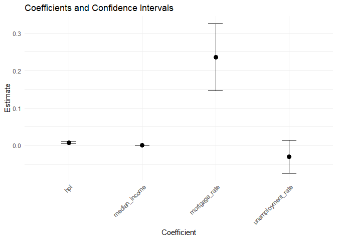

Class Project
================

- [Table of Contents](#table-of-contents)
  - [Checkpoint 1: Progress on Eight Major
    Tasks](#checkpoint-1-progress-on-eight-major-tasks)
  - [Research Topic](#research-topic)
  - [Meeting Minutes and Personal
    Contributions](#meeting-minutes-and-personal-contributions)
  - [Load Packages, Setup API Keys, Import
    Data](#load-packages-setup-api-keys-import-data)
  - [**Compute Summary Statistics**](#compute-summary-statistics)
  - [**Create Visualizations**](#create-visualizations)

<div class="alert alert-warning">

**This landing page displays the knitted output of our README.rmd file.
For the code behind the analysis and figures shown below, please consult
the README.rmd file.**

</div>

<!-- Optional spacer -->

<br>

# Table of Contents

## Checkpoint 1: Progress on Eight Major Tasks

**1) Propose a research topic**

> Each team member proposed a thoughtful research topic along with
> relevant data sources. After deliberation (see meeting minutes below),
> our team chose to study how mortgage rates influence home ownership
> rates across the U.S. To study this topic, our team is constructing a
> panel dataset comprised of several reliable data sources including
> data from the U.S. Census Bureau, FRED, and BLS. We will organize our
> findings to Scott Turner, Secretary of Housing and Urban Development
> (HUD), to inform U.S. housing policy decisions.

**2) Create a GitHub repository and establish best practices for team
collaboration**

> We have created a GitHub repository. Each member has made substantial
> contributions. Thus far, we have included the following in this
> repository: the project topic, meeting minutes, information on the
> packages and API keys needed for analysis, code to import relevant
> data, summary statistics for key variables, and several helpful
> visualizations.

**3) Demonstrate merging of multiple data sources**

> To construct our panel dataset, we have imported, cleaned, and merged
> several data sources: population and income income data from the
> Census, home ownership data from the Census, the housing price index,
> unemployment data from BLS, and mortgage data from FRED.

**4) Visualize data using Tableau, R, Python, or a combination**

> We have used R to create several figures, including line graphs and
> histograms to accompany the summary statistics.

**5) Generate meaningful summary statistic (KPIs) of the data**

> We have generated summary statistics for the key variables we intend
> to analyze.

**6) Submit draft of progress at Checkpoint 1 and Checkpoint 2**

> This branch is our Checkpoint 1 Submission.

**7) Summarize your findings in a short video presentation**

> We will make progress on this in the coming weeks.

**8) Publish a detailed, well formatted markdown report of your
analytical story to your GitHub repository**

> We have posted this markdown file to our landing page. This will
> become the basis of our report.

## Research Topic

**Our proposed research question is: How have changes in mortgage
interest rates and housing prices affected home ownership rates across
U.S. states over time?**

To study this, we plan to build a panel data set that examines each
state-year on home ownership rate, housing affordability, mortgage
rates, and other relevant variables like median income or unemployment
rate. Our primary data sources will be the U.S. Census Bureau and the
Federal Reserve Economic Data (FRED), which includes state home
ownership rates and the 30-year fixed mortgage rate. Additionally, the
Federal Housing Finance Agency’s House Price Index, which provides
state-level data on house price changes, and the Bureau of Labor
Statistics, which has state-level data on unemployment, will be pulled.
Together, these sources will provide panel data that can be used to
examine how rising mortgage rates and increasing prices affect home
ownership, while allowing room for controls like unemployment, median
income, or population, to understand this effect better.

Once we have established the relationship between mortgage interest
rates, housing affordability, and home ownership rates, we will consider
what policy options or levers are available to improve home ownership
rates. We may do this by conducting additional primary analysis to test
the efficacy of certain policies where data are available, or by
consulting the relevant literature to form reasonable conclusions about
the linkages between various housing policies and mortgage
rates/affordability. Once we have identified policy recommendations, we
will present these to the U.S. Secretary of Housing and Urban
Development, Scott Turner.

The Secretary of Housing and Urban Development (HUD) manages the
Department of Housing and Urban Development, with responsibilities
including the creation and oversight of affordable housing policies and
programs and advising the President on housing issues. As our ultimate
aim is to contribute to improving home ownership rates, we will explore
the various economic indicators that may positively or negatively impact
this, strategically analyzing these relationships in order to make
predictions and recommendations for affecting future policy change.
Secretary Turner has the power to act on these recommendations, with his
actions guided by a goal of creating affordable housing policy. Our work
exploring home ownership rates is well-aligned not only with this goal,
but also Turner’s previous efforts on opportunity zones. Thus, Scott
Turner is the key figure whom we will focus the implications of our
findings toward. We plan to create these visualizations using a mix of
software programs (including R and Tableau) to create easily and quickly
digestible visualizations that best inform and support our
recommendations.

**Sources:**

- <https://fred.stlouisfed.org/series/MORTGAGE30US>
- <https://www.fhfa.gov/data/hpi/datasets?tab=quarterly-data>
- <https://www.census.gov/data.html>
- <https://www.bls.gov/web/laus/laumstrk.htm>

## Meeting Minutes and Personal Contributions

### **Meeting 1 (02/25):**

Initial meeting of Liz, Ryan, and Levi; we decided on a weekly meeting
time, went through the requirements for the project, and established a
shared document. We planned to each pitch an idea (i.e., provide a brief
description and data source links) in advance of our next meeting, at
which we hoped to narrow in on a topic.

### **Meeting 2 (03/04):**

**Ideas**

- Levi: Minimum Wage/Food Security/Poverty Programs
  - Description: The Center for Poverty Research compiled an impressive
    and easy-to-use dataset with information on state policies such as
    the minimum wage, SNAP, EITC, and so on. I propose using this
    dataset to measure whether/how these policies have influenced
    variables of interest such as poverty, employment, or food
    insecurity. The data set is fairly comprehensive (part of the
    appeal), but I think it would be easy to find opportunities to
    supplement it with other datasets. For example, the food insecurity
    data in the Center for Poverty Research dataset only goes up
    to 2001. If we wanted to look at how state economic policies have
    influenced food insecurity over the past two decades, we would need
    to pull in another dataset. I just filled out an online form offered
    by Feeding America to request access to their food insecurity data
    (available at the state level). They agreed to share it with us, so
    that’s one option. I can think of plenty of other options, too. For
    example, we could pull in Census data (I have experience scraping
    Census data with R using an API key) to analyze whether these
    policies influenced the ratio of people that own vs rent their
    homes. Generally speaking, these analyses would require rigorous
    controls, so there would be ample opportunity to pull in multiple
    datasets to try and control for other factors that may influence
    these endpoints.  
  - Potential data sources:  
    - **National Welfare Data:** “The Center for Poverty Research
    annually updates our state-level panel data series covering
    population, employment, unemployment, welfare, poverty, and
    politics. Our current update includes information for the majority
    of the 2024 calendar year. We will update the remainder when
    available. These data are publicly available to all users.”  
    - Link: <https://ukcpr.uky.edu/resources>  
    - **Feeding America Food Insecurity Data:** “Since 2011, Feeding
    America has produced the Map the Meal Gap study, providing estimates
    of local food insecurity and food costs on an annual basis to better
    understand people and places facing hunger and to inform decisions
    and actions that will help us achieve our mission. We do this by
    generating national and local data about food insecurity,
    translating those data into insights and tools like the interactive
    map below, and engaging partners to help them use and improve our
    data and research in the future.”  
    - Link: <https://map.feedingamerica.org/>
- Liz: Accessibility to alcohol’s relationship to levels of binge
  drinking in a given (Iowa) county
  - Description: The Iowa Department of Health and Human Services has
    already launched a new campaign called Say “Yes” to Drinking Less
    Alcohol, to combat high rates of binge drinking. Aiming to
    investigate whether factors like accessibility to alcohol are
    correlated to higher levels of binge drinking could inform where to
    best focus future resources and interventions. Targeted campaigns
    and/or subsequent action by Iowa Department of Health and Human
    Services, in conjunction with community partners, in areas that show
    higher levels of average binge drinking could aid in the ultimate
    goal of improving health, safety, and alcohol responsibility in
    Iowa. We could compare the rate across states, explore whether/how
    the severity has changed over time, and look into the local data
    from class to compare behavioral data to accessibility (e.g.,
    looking at number of stores in a given area) and purchase rates at a
    county level.  
  - Potential data sources:  
    - **Class Data on Iowa Liquor Sales:** would provide specific store
    location as well as county-by-county info and sales stats  
    - Link:
    <https://data.iowa.gov/Sales-Distribution/Iowa-Liquor-Sales/m3tr-qhgy/about_data>  
    - **U.S. National Health Stats Ranking:** allow for the
    contextualization of a focus on Iowa and make clear the imminent
    need for further work aimed at lowering binge drinking levels;
    provides national excess drinking data.  
    - Link:
    <https://www.americashealthrankings.org/explore/measures/ExcessDrink/IA>  
    - **Behavioral Risk Factor Surveillance System (BRFSS) Data:**
    provides past years’ BRFSS data; this is used to measure progress
    toward health goals and is conducted annually in Iowa. Iowa BRFSS
    survey data supports the creation and implementation of public
    health activities and, per the Iowa Health and Human Services
    website, “aims to reducing chronic diseases and other leading causes
    of death for Iowans.”  
    - Link: <https://hhs.iowa.gov/about/data-reports/brfss>
- **Ryan: Housing Costs, Interest Rates, and home ownership in the
  U.S.**
  - Description: My idea is to study how mortgage interest rates and
    housing prices affect home ownership rates across states. We could
    combine Census housing data, FRED mortgage rates, and FHFA house
    price indexes to build a panel dataset and estimate how changes in
    borrowing costs and housing prices influence home ownership or rent
    burden over time. One potential research question would be: How do
    changes in mortgage interest rates and housing prices affect home
    ownership rates across U.S. states over time? Data should be
    relatively easy to access and merge. Housing outcomes are influenced
    by many economic factors, so we could add controls like median
    income, unemployment rates, or population growth to isolate the
    effect of interest rates and housing prices. We could explore
    regional differences, like if changes in interest rates affect home
    ownership differently in high-cost housing markets compared to more
    affordable states. We’d probably create a panel dataset that
    observes states over time, so each state-year would be an
    observation. The panel would track how home ownership rates change
    as mortgage rates, housing prices, and other economic variables
    change.  
  - Potential data sources:  
    - **Home ownership and Housing Data:** The U.S. Census Bureau
    provides state and national data on home ownership rates, housing
    costs, median home values, rent burdens, and other housing market
    indicators. These data are available through FRED.  
    - Link:
    <https://fred.stlouisfed.org/searchresults/?st=homeownership%20rates%20by%20state>  
    - Link: <https://fred.stlouisfed.org/series/RSAHORUSQ156S>  
    - **Mortgage Interest Rate Data:** The Federal Reserve Economic Data
    (FRED) database provides historical mortgage interest rates and
    other macroeconomic indicators that can be merged with housing data
    to analyze how changes in borrowing costs affect housing outcomes.  
    - Link: <https://fred.stlouisfed.org/series/MORTGAGE30US>  
    - **Housing Price Index Data:** The Federal Housing Finance Agency
    (FHFA) provides a House Price Index with quarterly and annual data
    on housing price changes at the state and metropolitan levels.  
    - Link: <https://www.fhfa.gov/data/hpi/datasets?tab=quarterly-data>

**Discussion:** After talking through the ideas, Levi pointed out that
Ryan’s idea had overlap with the Federal Reserve data that we had to use
for R HW 3. We agreed to proceed with that topic and aimed to think
about it in parallel with the homework. We each tried to merge data sets
to make sure we had the skill to do so moving forward.

### **Meeting 3 (03/11)**

We finalized our decision to focus on Ryan’s proposed topic, and
prepared for our topic submission due 03/13. In preparation, we split up
the work as such:

- Ryan will submit the topic on Canvas course page  
- All will work on respective sections
  - Levi: Process of choosing a topic, opportunities to expand.
  - Liz: Policy implications Scott Turner HUD
  - Ryan: Topic (research question, data sources)  
- Levi will inform Bangjun (former group member) of the plan to log
  notes in this document rather than sending weekly emails  
- Liz will create a GitHub page, will add everyone as collaborators &
  email Prof Chale with a status update about a potential issue
- Ryan will upload a file joining Census and FRED data, including a loop
  to bring in multiple years of Census data  
- Levi will investigate data availability for controlling for state
  housing policy

### **Meeting 4 (03/18)**

We talked through the Checkpoint 1 criteria and made the following plan
in advance of Meeting 5:  
- Work on README/update on Github (update on personal contributions, add
progress updates for each checkpoint, etc.)  
- Try to run code that someone else posted on github and become more
familiar with platform/collaborative repositories  
- If possible, try to create simple visualizations  
- Date to keep in mind: April 14th (project draft is due)

### **Meeting 5 (03/25)**

We discussed our progress on using our collaborative github repo. We
also brainstormed ideas about additional potential directions in
response to the feedback we received on our topic submission earlier in
the week. We then divided up remaining tasks necessary for the
Checkpoint 1 submission as follows:

- Liz: Add remaining (Meeting 5) updates; fix formatting (adjust
  headers, resolve spacing issues, add bullets, etc.); clean
  up/formalize wording of notes where necessary
- Levi: Fill in progress on 8 major tasks and submission  
- Ryan: Create histogram plots of variable and move to README

In advance of Meeting 6, we plan to look into:  
- Potential variables to control for like state housing policies
(explore law atlas data sets)  
- How home ownership impacts wealth for households, per topic submission
feedback  
- Lags in mortgage and home ownership rates

## Load Packages, Setup API Keys, Import Data

### **Meeting 6 (03/30)**

We reviewed the feedback on our Checkpoint 1 submission and the what we
need to work on for Checkpoint 2. In advance of our meeting next week,
we made a list of the following action items to address some of the
feedback and begin preparing to work towards Checkpoint 2:

- Liz: Import repository to group page and update README
  - If time, look into using the integrated GitHub Project tool  
- Levi: In the README include descriptions of where to find files  
- Ryan: Clean repositor and make image file names more descriptive  
- All: Try to get more familiar working with datasets we plan to use

### **Load Required Packages:**

- tidyverse
- janitor
- readr
- readxl
- tidycensus
- fredr
- lubridate
- tsibble
- fpp3

### **Set API Keys:**

- [tidycensus api key](https://api.census.gov/data/key_signup.html)
- [fredr api key](https://fred.stlouisfed.org/docs/api/api_key.html)

### **Import online data:**

### **Import local data:**

**Merge imported data:**

``` r
#Merge the data sets by year and state
merged <- left_join(
  population,
  income,
  by = c("state", "year")
) %>%
  left_join(
    homeownership,
    by = c("state", "year")
  ) %>%
  left_join(
    hpi_annual,
    by = c("state", "year")
  ) %>%
  left_join(
    state_unemployment,
    by = c("state", "year")
  ) %>%
  left_join(
    rent_burden,
    by = c("state", "year")
  ) %>%
  left_join(
    permits_state,
    by = c("state", "year")
  ) %>%
  left_join(
    mortgage_annual,
    by = "year"
  )
```

## **Compute Summary Statistics**

### **Compute population summary statistics:**

    ## Summary statistics for population:

    ##     Min.  1st Qu.   Median     Mean  3rd Qu.     Max. 
    ##   495226  1814815  4439766  6341021  7321456 39557045

    ## Standard Deviation: 7047104

    ## Variance: 4.966168e+13

### **Compute median income summary statistics:**

    ## Summary statistics for median income:

    ##    Min. 1st Qu.  Median    Mean 3rd Qu.    Max. 
    ##   32938   47449   55646   58206   66919  104828

    ## Standard Deviation: 13858.12

    ## Variance: 192047587

### **Compute home ownership rate summary statistics:**

    ## Summary statistics for homeownership rate:

    ##    Min. 1st Qu.  Median    Mean 3rd Qu.    Max. 
    ##   52.98   65.03   67.51   66.96   70.01   76.30

    ## Standard Deviation: 4.429418

    ## Variance: 19.61974

### **Compute mortgage rate summary statistics:**

    ## Summary statistics for mortgage rate:

    ##    Min. 1st Qu.  Median    Mean 3rd Qu.    Max. 
    ##   2.958   3.936   4.545   4.864   6.027   6.807

    ## Standard Deviation: 1.152201

    ## Variance: 1.327568

### **Compute HPI summary statistics**

    ## Summary statistics for HPI:

    ##    Min. 1st Qu.  Median    Mean 3rd Qu.    Max. 
    ##   183.5   286.2   365.8   406.6   473.6  1229.7

    ## Standard Deviation: 163.7395

    ## Variance: 26810.63

### **Compute unemployment summary statistics**

    ## Summary statistics for Unemployment:

    ##    Min. 1st Qu.  Median    Mean 3rd Qu.    Max. 
    ##   1.800   3.700   4.700   5.262   6.500  13.500

    ## Standard Deviation: 2.131641

    ## Variance: 4.543892

### **Compute rent burden summary statistics:**

    ##    Min. 1st Qu.  Median    Mean 3rd Qu.    Max. 
    ##   28.27   41.79   44.88   44.62   47.51   58.14

    ## Standard Deviation: 4.371337

    ## Variance: 19.10859

## **Create Visualizations**

### **Plot histograms of key variables:**

<!-- -->

### **Plot mortgage rate and national average homeownership rate:**

<!-- -->

### **Correlation Matrix:**

<!-- -->

### Missingness check:

    ## # A tibble: 8 × 2
    ##   variable           missing_count
    ##   <chr>                      <int>
    ## 1 homeownership_rate             0
    ## 2 median_income                  0
    ## 3 population                     0
    ## 4 hpi                            0
    ## 5 unemployment_rate              0
    ## 6 mortgage_rate                  0
    ## 7 rent_burden                    0
    ## 8 housing_permits                0

### Other plots:

<!-- -->

<!-- --> \## Analysis \###
Multicollinearity check:

    ##     mortgage_rate               hpi unemployment_rate     median_income 
    ##          1.169683          3.552392          2.047872          3.075912 
    ##       rent_burden   housing_permits 
    ##          2.289029          1.229762

### Merged + Lag variables:

### Regression Analysis

For directions on how to conduct multilinear regression and plot
confidence intervals, [click
here](https://www.geeksforgeeks.org/r-language/how-to-use-the-coeftest-function-in-r/).

``` r
#Create a simple multilinear regression model
model1 <- lm(homeownership_rate ~ mortgage_rate + hpi + median_income +
               unemployment_rate + state + year, data = merged )

#Summarize model
summary(model1)
```

    ## 
    ## Call:
    ## lm(formula = homeownership_rate ~ mortgage_rate + hpi + median_income + 
    ##     unemployment_rate + state + year, data = merged)
    ## 
    ## Residuals:
    ##     Min      1Q  Median      3Q     Max 
    ## -3.3732 -0.6241 -0.0287  0.5922  4.4400 
    ## 
    ## Coefficients:
    ##                       Estimate Std. Error t value Pr(>|t|)    
    ## (Intercept)          5.492e+02  4.970e+01  11.050  < 2e-16 ***
    ## mortgage_rate        2.360e-01  4.561e-02   5.175 2.81e-07 ***
    ## hpi                  7.519e-03  9.515e-04   7.903 7.98e-15 ***
    ## median_income        3.883e-05  1.943e-05   1.998   0.0460 *  
    ## unemployment_rate   -3.007e-02  2.254e-02  -1.334   0.1825    
    ## stateAlaska         -5.960e+00  6.077e-01  -9.807  < 2e-16 ***
    ## stateArizona        -4.900e+00  3.631e-01 -13.495  < 2e-16 ***
    ## stateArkansas       -2.696e+00  3.397e-01  -7.937 6.16e-15 ***
    ## stateCalifornia     -1.682e+01  4.476e-01 -37.581  < 2e-16 ***
    ## stateColorado       -5.579e+00  4.418e-01 -12.628  < 2e-16 ***
    ## stateConnecticut    -4.314e+00  5.504e-01  -7.839 1.28e-14 ***
    ## stateDelaware        7.726e-01  4.087e-01   1.890   0.0591 .  
    ## stateFlorida        -3.603e+00  3.472e-01 -10.380  < 2e-16 ***
    ## stateGeorgia        -5.074e+00  3.665e-01 -13.845  < 2e-16 ***
    ## stateHawaii         -1.364e+01  5.035e-01 -27.091  < 2e-16 ***
    ## stateIdaho          -1.771e-01  3.477e-01  -0.509   0.6106    
    ## stateIllinois       -2.991e+00  4.307e-01  -6.945 7.30e-12 ***
    ## stateIndiana         5.356e-01  3.657e-01   1.465   0.1434    
    ## stateIowa            2.209e+00  3.941e-01   5.604 2.79e-08 ***
    ## stateKansas         -2.052e+00  3.925e-01  -5.229 2.12e-07 ***
    ## stateKentucky       -1.335e+00  3.384e-01  -3.945 8.61e-05 ***
    ## stateLouisiana      -2.364e+00  3.408e-01  -6.936 7.73e-12 ***
    ## stateMaine           9.413e-01  3.660e-01   2.572   0.0103 *  
    ## stateMaryland       -4.444e+00  6.005e-01  -7.401 3.12e-13 ***
    ## stateMassachusetts  -1.113e+01  4.809e-01 -23.141  < 2e-16 ***
    ## stateMichigan        2.751e+00  3.644e-01   7.550 1.07e-13 ***
    ## stateMinnesota       2.044e+00  4.658e-01   4.388 1.28e-05 ***
    ## stateMississippi     2.517e-01  3.449e-01   0.730   0.4656    
    ## stateMissouri       -1.510e+00  3.510e-01  -4.303 1.87e-05 ***
    ## stateMontana        -2.084e+00  3.448e-01  -6.044 2.20e-09 ***
    ## stateNebraska       -2.966e+00  3.923e-01  -7.561 9.88e-14 ***
    ## stateNevada         -1.242e+01  3.905e-01 -31.808  < 2e-16 ***
    ## stateNew Hampshire  -9.292e-02  5.086e-01  -0.183   0.8551    
    ## stateNew Jersey     -7.497e+00  5.569e-01 -13.462  < 2e-16 ***
    ## stateNew Mexico     -1.013e+00  3.381e-01  -2.998   0.0028 ** 
    ## stateNew York       -1.854e+01  4.041e-01 -45.874  < 2e-16 ***
    ## stateNorth Carolina -3.891e+00  3.435e-01 -11.327  < 2e-16 ***
    ## stateNorth Dakota   -5.600e+00  3.999e-01 -14.005  < 2e-16 ***
    ## stateOhio           -2.220e+00  3.660e-01  -6.066 1.93e-09 ***
    ## stateOklahoma       -2.691e+00  3.564e-01  -7.551 1.06e-13 ***
    ## stateOregon         -8.588e+00  3.644e-01 -23.569  < 2e-16 ***
    ## statePennsylvania   -1.088e+00  3.642e-01  -2.987   0.0029 ** 
    ## stateRhode Island   -1.033e+01  3.893e-01 -26.537  < 2e-16 ***
    ## stateSouth Carolina -2.281e-01  3.406e-01  -0.670   0.5032    
    ## stateSouth Dakota   -1.826e+00  3.596e-01  -5.079 4.62e-07 ***
    ## stateTennessee      -2.533e+00  3.396e-01  -7.458 2.07e-13 ***
    ## stateTexas          -6.893e+00  3.984e-01 -17.303  < 2e-16 ***
    ## stateUtah           -9.795e-01  4.486e-01  -2.184   0.0293 *  
    ## stateVermont         1.306e-01  3.694e-01   0.354   0.7238    
    ## stateVirginia       -4.302e+00  4.727e-01  -9.102  < 2e-16 ***
    ## stateWashington     -8.659e+00  4.336e-01 -19.971  < 2e-16 ***
    ## stateWest Virginia   4.883e+00  3.428e-01  14.245  < 2e-16 ***
    ## stateWisconsin      -2.072e+00  3.839e-01  -5.397 8.69e-08 ***
    ## stateWyoming         2.286e-01  4.176e-01   0.547   0.5842    
    ## year                -2.408e-01  2.494e-02  -9.655  < 2e-16 ***
    ## ---
    ## Signif. codes:  0 '***' 0.001 '**' 0.01 '*' 0.05 '.' 0.1 ' ' 1
    ## 
    ## Residual standard error: 1.042 on 895 degrees of freedom
    ## Multiple R-squared:  0.9478, Adjusted R-squared:  0.9447 
    ## F-statistic: 301.2 on 54 and 895 DF,  p-value: < 2.2e-16

``` r
#Create coefficients and standard errors
coefficients <- coef(model1)[c("mortgage_rate", "hpi", "median_income", "unemployment_rate")]
std_errors <- sqrt(diag(vcov(model1)))[c("mortgage_rate", "hpi", "median_income", "unemployment_rate")]

#Create data needed to plot confidence intervals
plot_data <- data.frame(
  Coefficient = names(coefficients),
  Estimate = coefficients,
  Std_Error = std_errors
)

#create plot of coefficients and confidence interval
ggplot(plot_data, aes(x = Coefficient, y = Estimate, ymin = Estimate - 1.96 * Std_Error,
                                           ymax = Estimate + 1.96 * Std_Error)) +
  geom_point(size = 3) +
  geom_errorbar(width = 0.2) +
  labs(title = "Coefficients and Confidence Intervals",
       x = "Coefficient",
       y = "Estimate") +
  theme_minimal() +
  theme(axis.text.x = element_text(angle = 45, hjust = 1))
```

<!-- -->

``` r
#Calculate clustered standard errors
model1_cluster_se <- vcovCL(model1, cluster = ~ state)
summary_clustered <- coeftest(model1, vcov = model1_cluster_se)
print(summary_clustered)
```

    ## 
    ## t test of coefficients:
    ## 
    ##                        Estimate  Std. Error  t value  Pr(>|t|)    
    ## (Intercept)          5.4920e+02  1.0415e+02   5.2732 1.682e-07 ***
    ## mortgage_rate        2.3603e-01  7.5758e-02   3.1156  0.001894 ** 
    ## hpi                  7.5194e-03  1.5270e-03   4.9242 1.008e-06 ***
    ## median_income        3.8827e-05  3.4504e-05   1.1253  0.260772    
    ## unemployment_rate   -3.0071e-02  2.4914e-02  -1.2070  0.227747    
    ## stateAlaska         -5.9599e+00  8.9681e-01  -6.6457 5.238e-11 ***
    ## stateArizona        -4.8996e+00  2.8845e-01 -16.9859 < 2.2e-16 ***
    ## stateArkansas       -2.6962e+00  8.7343e-02 -30.8691 < 2.2e-16 ***
    ## stateCalifornia     -1.6823e+01  7.0769e-01 -23.7719 < 2.2e-16 ***
    ## stateColorado       -5.5792e+00  6.0805e-01  -9.1755 < 2.2e-16 ***
    ## stateConnecticut    -4.3144e+00  8.4921e-01  -5.0805 4.583e-07 ***
    ## stateDelaware        7.7257e-01  5.1222e-01   1.5083  0.131840    
    ## stateFlorida        -3.6034e+00  2.0804e-01 -17.3212 < 2.2e-16 ***
    ## stateGeorgia        -5.0741e+00  2.7590e-01 -18.3910 < 2.2e-16 ***
    ## stateHawaii         -1.3642e+01  8.2528e-01 -16.5297 < 2.2e-16 ***
    ## stateIdaho          -1.7714e-01  2.0804e-01  -0.8515  0.394720    
    ## stateIllinois       -2.9909e+00  4.9658e-01  -6.0230 2.498e-09 ***
    ## stateIndiana         5.3559e-01  2.3163e-01   2.3123  0.020988 *  
    ## stateIowa            2.2087e+00  3.2869e-01   6.7199 3.234e-11 ***
    ## stateKansas         -2.0523e+00  3.2134e-01  -6.3868 2.719e-10 ***
    ## stateKentucky       -1.3351e+00  2.3540e-02 -56.7169 < 2.2e-16 ***
    ## stateLouisiana      -2.3639e+00  7.6224e-02 -31.0121 < 2.2e-16 ***
    ## stateMaine           9.4125e-01  3.1361e-01   3.0014  0.002762 ** 
    ## stateMaryland       -4.4440e+00  9.8442e-01  -4.5143 7.200e-06 ***
    ## stateMassachusetts  -1.1128e+01  8.8037e-01 -12.6404 < 2.2e-16 ***
    ## stateMichigan        2.7510e+00  2.4275e-01  11.3327 < 2.2e-16 ***
    ## stateMinnesota       2.0442e+00  5.9812e-01   3.4177  0.000660 ***
    ## stateMississippi     2.5172e-01  1.4714e-01   1.7108  0.087467 .  
    ## stateMissouri       -1.5103e+00  1.6923e-01  -8.9247 < 2.2e-16 ***
    ## stateMontana        -2.0839e+00  1.6172e-01 -12.8858 < 2.2e-16 ***
    ## stateNebraska       -2.9662e+00  3.2584e-01  -9.1033 < 2.2e-16 ***
    ## stateNevada         -1.2420e+01  3.7504e-01 -33.1170 < 2.2e-16 ***
    ## stateNew Hampshire  -9.2924e-02  7.6879e-01  -0.1209  0.903821    
    ## stateNew Jersey     -7.4973e+00  9.4158e-01  -7.9624 5.101e-15 ***
    ## stateNew Mexico     -1.0135e+00  2.3511e-02 -43.1050 < 2.2e-16 ***
    ## stateNew York       -1.8538e+01  5.7499e-01 -32.2408 < 2.2e-16 ***
    ## stateNorth Carolina -3.8906e+00  1.4829e-01 -26.2371 < 2.2e-16 ***
    ## stateNorth Dakota   -5.6003e+00  3.5627e-01 -15.7190 < 2.2e-16 ***
    ## stateOhio           -2.2203e+00  2.3243e-01  -9.5524 < 2.2e-16 ***
    ## stateOklahoma       -2.6913e+00  1.6765e-01 -16.0525 < 2.2e-16 ***
    ## stateOregon         -8.5884e+00  3.5451e-01 -24.2261 < 2.2e-16 ***
    ## statePennsylvania   -1.0877e+00  3.1288e-01  -3.4762  0.000533 ***
    ## stateRhode Island   -1.0332e+01  5.0122e-01 -20.6137 < 2.2e-16 ***
    ## stateSouth Carolina -2.2810e-01  1.0721e-01  -2.1277  0.033639 *  
    ## stateSouth Dakota   -1.8265e+00  2.1423e-01  -8.5259 < 2.2e-16 ***
    ## stateTennessee      -2.5327e+00  8.5846e-02 -29.5030 < 2.2e-16 ***
    ## stateTexas          -6.8934e+00  3.5674e-01 -19.3232 < 2.2e-16 ***
    ## stateUtah           -9.7952e-01  5.9472e-01  -1.6470  0.099904 .  
    ## stateVermont         1.3059e-01  3.6384e-01   0.3589  0.719741    
    ## stateVirginia       -4.3022e+00  6.7515e-01  -6.3722 2.978e-10 ***
    ## stateWashington     -8.6586e+00  6.4678e-01 -13.3874 < 2.2e-16 ***
    ## stateWest Virginia   4.8828e+00  1.4038e-01  34.7829 < 2.2e-16 ***
    ## stateWisconsin      -2.0719e+00  3.3845e-01  -6.1219 1.382e-09 ***
    ## stateWyoming         2.2864e-01  4.2060e-01   0.5436  0.586854    
    ## year                -2.4076e-01  5.2264e-02  -4.6066 4.687e-06 ***
    ## ---
    ## Signif. codes:  0 '***' 0.001 '**' 0.01 '*' 0.05 '.' 0.1 ' ' 1
